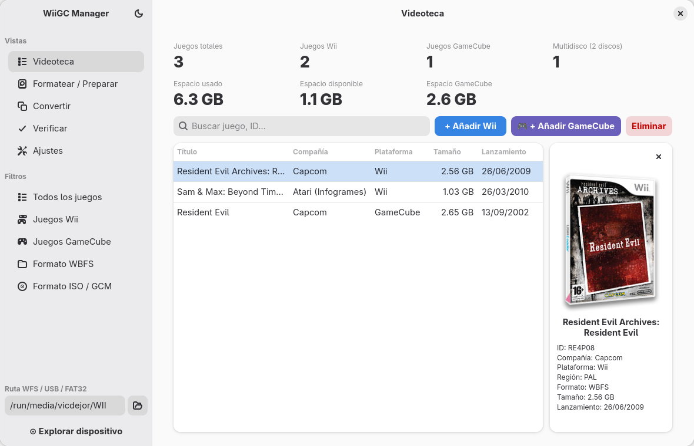
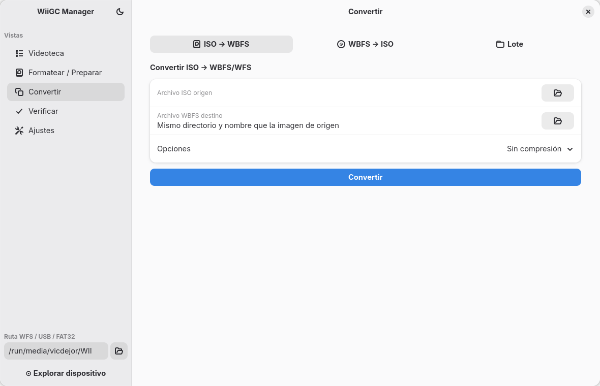

# WiiGC-Manager

Gestor de juegos de **Wii** y **GameCube** para unidades USB y tarjetas SD: añade, elimina, convierte, verifica y copia juegos, y prepara la unidad para usarla en la consola con WiiFlow, USB Loader GX y Nintendont. Está construido sobre las herramientas [`wit` y `wwt`](https://wit.wiimm.de/) de Wiimm.

> Funciona exclusivamente en **Linux** y necesita `wit` y `wwt` instalados.



## Dos versiones

El proyecto tiene dos interfaces sobre el mismo motor (`wii-manager-server.py`). Elige la que prefieras:

| | [Versión de escritorio (GTK4)](#versión-de-escritorio-gtk4) | [Versión web](#versión-web) |
|---|---|---|
| **Qué es** | App nativa GTK4/libadwaita | Servidor local + interfaz en el navegador |
| **Cómo se lanza** | `./run-gtk.sh`, como Flatpak o como AppImage | `./launch.sh` |
| **Necesita** | Python 3.8+, PyGObject, GTK 4, libadwaita | Python 3.6+ y un navegador |
| **Estado** | Desarrollo activo; la más completa | Versión original |
| **Código** | `wii-manager-gtk/` | `wii-manager.html` |

Lo que hacen las dos:

- 📋 **Listar** los juegos de la unidad con título, ID, tamaño y región
- ➕ **Añadir** juegos de Wii (ISO / WBFS) y de GameCube
- ❌ **Eliminar** juegos, de uno en uno o varios a la vez
- 🔄 **Convertir** entre ISO y WBFS, también en lote
- ✅ **Verificar** la integridad de los juegos
- 💽 **Formatear y preparar** la unidad para los cargadores de la consola
- 🖼️ **Carátulas** de [GameTDB](https://www.gametdb.com/Wii), con alternativas por región y tipo
- 🔍 **Búsqueda y filtros**, estadísticas de espacio y terminal con los comandos ejecutados

Lo que solo hace la versión de escritorio:

- 🚚 **Migrar** todos los juegos de una unidad a otra, p. ej. a un disco de más capacidad
- 📤 **Copiar** los juegos seleccionados a otra unidad
- 💾 **Extraer** juegos a una carpeta del PC, en ISO o WBFS
- 🔌 **Detectar** al momento las unidades que se conectan o se retiran
- 🎞️ **Banner animado** del juego de Wii como tipo de carátula, leído del propio juego
- 🔊 **Sonido del banner** del juego seleccionado, como en el menú de la consola
- 🐬 **Jugar en Dolphin** con doble clic, si el emulador está instalado
- 🖨️ **Guardar e imprimir** la carátula completa a tamaño de funda de DVD
- 🧩 **Descargar homebrew** del catálogo de la [Open Shop Channel](https://oscwii.org/library) en la unidad, con filtros por categoría

## Requisitos comunes

- Linux (cualquier distribución moderna)
- Python 3
- `wit` y `wwt` accesibles en el `PATH`

`wit` y `wwt` se descargan de <https://wit.wiimm.de/download.html>. En Debian/Ubuntu pueden estar en los repositorios:

```bash
sudo apt install wit
```

Para leer una partición WBFS, tu usuario necesita permiso sobre el dispositivo:

```bash
sudo usermod -aG disk $USER
# Cierra sesión y vuelve a entrar para que tenga efecto
```

Descarga del proyecto, válida para las dos versiones:

```bash
git clone https://github.com/vjorgemol/WiiGC-Manager.git
cd WiiGC-Manager
```

---

## Versión de escritorio (GTK4)

App nativa para GNOME y otros escritorios, sin servidor ni navegador de por medio.

📖 **[Manual de uso](MANUAL.html)**: instalación, Videoteca, homebrew, formateo, conversión, migración, verificación y solución de problemas.



### Requisitos

| Componente | Para qué | Obligatorio |
|---|---|---|
| GTK 4 y libadwaita | La interfaz | Sí |
| Python 3.8 o posterior, con PyGObject | Ejecutar la app | Sí |
| `wit` y `wwt` | Leer, copiar, convertir y verificar juegos de Wii | Sí |
| Dolphin | Añadir imágenes RVZ o GCZ y jugar con doble clic | Solo para eso |
| Conexión a internet | Carátulas, datos de los juegos y descarga de cargadores y homebrew | No |

En Fedora, la parte gráfica se instala con:

```bash
sudo dnf install python3-gobject gtk4 libadwaita
```

### Ejecutar desde el código fuente

```bash
./run-gtk.sh
```

### Instalar como Flatpak

```bash
cd WiiGC-Manager/flatpak
./build.sh
flatpak install --user WiiGC-Manager.flatpak
```

Después aparece como **WiiGC Manager** en el menú de aplicaciones. El Flatpak usa el `wit`, el `wwt` y el Dolphin instalados en el sistema: no los incluye.

### Ejecutar como AppImage

Un único archivo ejecutable, sin instalación, para **Ubuntu 24.04 o posterior** y **Fedora 40 o posterior** (x86_64). Lleva dentro Python, GTK4, libadwaita y GStreamer, así que no hay que instalar ninguna de esas dependencias.

```bash
cd WiiGC-Manager/appimage
./build.sh                              # necesita podman o docker, y conexión a internet
./WiiGC-Manager-x86_64.AppImage
```

Igual que el Flatpak, usa el `wit`, el `wwt` y el Dolphin instalados en el sistema: no los incluye.

La versión instalada y las novedades de cada versión se consultan en el diálogo **Acerca de** de la app.

---

## Versión web

La versión original: un servidor local en Python (solo biblioteca estándar) y una interfaz que se abre en el navegador.

### Uso

```bash
./launch.sh            # arranca el servidor y abre el navegador
./launch.sh --status   # indica si el servidor está en marcha
./launch.sh --log      # muestra el registro del servidor
./launch.sh --restart  # lo reinicia
./launch.sh --stop     # lo detiene
```

La interfaz queda en <http://localhost:8765> y solo es accesible desde el propio equipo. También se puede arrancar el servidor a mano:

```bash
python3 wii-manager-server.py
xdg-open http://localhost:8765
```

### Explorar la unidad

- Introduce la ruta de la partición WBFS en el campo lateral (p. ej. `/dev/sdb1`) o el punto de montaje de una unidad FAT32.
- Pulsa **Explorar dispositivo**.
- Si dejas el campo vacío, se usa `wwt --auto` para detectar la partición.

### Comandos que genera

| Operación | Comando |
|---|---|
| Listar juegos | `wwt LIST -p /dev/sdb1 --long` |
| Añadir ISO | `wwt ADD -p /dev/sdb1 "juego.iso"` |
| Eliminar juego | `wwt REMOVE -p /dev/sdb1 RMCP01` |
| Exportar a ISO | `wwt EXTRACT -p /dev/sdb1 RMCP01 --dest /ruta/` |
| Verificar partición | `wwt VERIFY -p /dev/sdb1` |
| Verificar archivo | `wit VERIFY "juego.iso"` |
| Espacio en disco | `wwt SPACE -p /dev/sdb1` |
| Detección automática | `wwt --auto LIST` |

### Carátulas

Las carátulas se cargan desde [GameTDB](https://art.gametdb.com) bajo demanda con el botón **⊡ Carátulas**. Si no existe la de la región configurada, se prueba en este orden:

- **Regiones:** `ES → EN → FR → DE → IT → PT → AU → US → JA → KO`
- **Tipos:** `cover3D → cover → coverfull → disc`

La región y el tipo preferidos se configuran en **Ajustes → Carátulas**.

### Lanzador de escritorio

Desde **Ajustes** se puede generar un archivo `.desktop` para lanzar la versión web desde el menú de aplicaciones.

### API del servidor

El servidor expone una API REST local en `http://localhost:8765`. Los endpoints principales:

| Endpoint | Método | Descripción |
|---|---|---|
| `/api/status` | GET | Detecta rutas de wit y wwt |
| `/api/list` | GET | Lista juegos y espacio en disco |
| `/api/add` | POST | Añade un ISO a la partición |
| `/api/remove` | POST | Elimina un juego por ID |
| `/api/extract` | POST | Exporta un juego a ISO |
| `/api/verify` | POST | Verifica integridad |
| `/api/run` | POST | Ejecuta un comando wit/wwt arbitrario |

Todos aceptan el parámetro `part` (ruta de la partición). Si se omite o está vacío, se usa `--auto`.

---

## Estructura del proyecto

```
WiiGC-Manager/
├── wii-manager-server.py    # Motor común (Python 3, solo biblioteca estándar) y servidor de la versión web
├── wii-manager.html         # Versión web: interfaz (HTML + CSS + JS, sin dependencias)
├── launch.sh                # Versión web: lanzador
├── wii-manager-gtk/         # Versión de escritorio: app GTK4/libadwaita
├── run-gtk.sh               # Versión de escritorio: lanzador
├── WiiGC-Manager/           # Versión de escritorio: copia empaquetable y archivos del Flatpak y de la AppImage
├── MANUAL.html              # Manual de uso de la versión de escritorio
└── README.md
```

## Licencia

MIT
